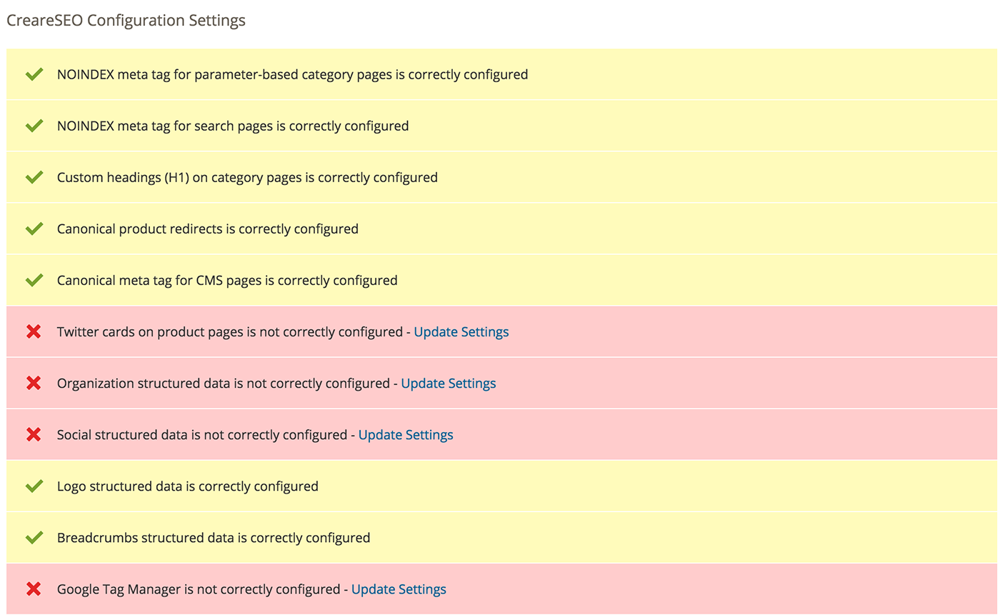
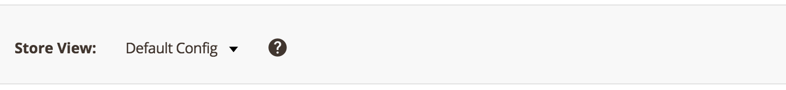
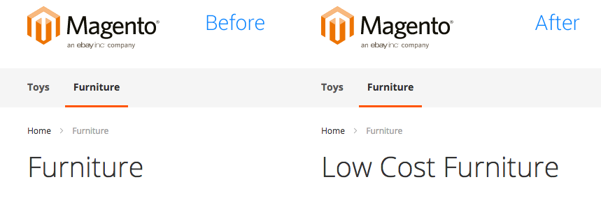
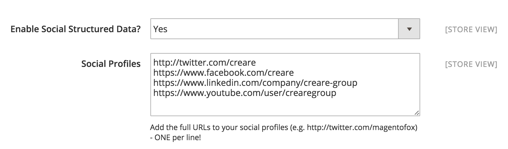
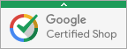
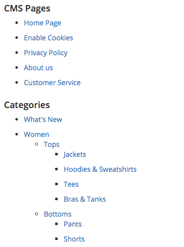

# FoxSEO for Magento 2

FoxSEO for Magento 2 (formerly CreareSEO 2.0) is a set of smart tools developed to help Magento 2 comply better with search engine optimisation standards. Everything can be configured by store administrators within the Magento 2 admin area.

- **SEO checklist** that suggests how your store should be configured
- **JSON-LD structured data** for store information, social accounts and breadcrumbs
- Features that help prevent **duplicate content** 
- Integrated with **Google Tag Manager** &amp; **Trusted Stores**
- **Page title and meta description templates** for products and categories

## How To Install via Composer

1. Navigate to your Magento root directory
2. `composer config repositories.magento composer https://github.com/adampmoss/foxseo2`
3. `composer require fox/seo`
4. `composer update`
5. `php bin/magento setup:upgrade`


## User Guide

This guide shows you how to use all of the features contained within this extension.

#### Contents

- [SEO Checklist](#seo-checklist)
    - [Changing Scope](#changing-scope)
- [Configuration](#configuration)
    - [SEO Settings](#seo-settings)
    - [Product Twitter Cards](#product-twitter-cards)
    - [Default Page Titles & Meta Descriptions](#default-page-titles-meta-descriptions)
    - [Organization Structured Data](#organization-structured-data)
    - [Social Structured Data](#social-structured-data)
    - [Breadcrumbs Structured Data](#breadcrumbs-structured-data)
    - [Google Tag Manager](#google-tag-manager)
    - [Google Content Grouping](#google-content-grouping)
    - [Google Sitelink Search](#google-sitelink-search)
    - [Google Trusted Store](#google-trusted-store)
- [HTML Sitemap](#html-sitemap)
- [Discontinued Product Redirects](#discontinued-product-redirects)
- [Product & Category Meta Robots](#product-category-meta-robots)

## SEO Checklist

Go to **Stores > FoxSEO > Checklist** 

This page gives you an overview of your Magento default configuration settings and FoxSEO's configuration settings. A yellow bar and a tick means the setting has been configured correctly for SEO, and a red bar with a cross means that you should configuration is not correct.



Many of the failed checks will provide a link to the configuration page needed to change the settings.

#### Changing Scope

When you visit the checklist page for the first time it will show you SEO configuration checks for the default configuration scope. You can switch between website views and store views by using the select dropdown at the top of the page:



## Configuration

Many of FoxSEO's features reside in the configuration area. 

Go to **Stores > FoxSEO > Settings** 

### SEO Settings

**Use NOINDEX, FOLLOW Meta Tag on Filtered Category Pages**

When set to 'Yes' category pages with filters applied will contain the "NOINDEX, FOLLOW" meta tag which means that search engine robots will be aware of the page, but the page won't be indexed.

**Use NOINDEX, FOLLOW Meta Tag on Search Results Page**

When set to 'Yes' the quick search results page will contain the "NOINDEX, FOLLOW" meta tag which means that search engine robots will be aware of the page, but the page won't be indexed.

**Use NOINDEX, FOLLOW Meta Tag on Advanced Search Results Page**

When set to 'Yes' the advanced search results page will contain the "NOINDEX, FOLLOW" meta tag which means that search engine robots will be aware of the page, but the page won't be indexed.

**Enable Unique Category Heading field**

By default, category pages will use the category name as the heading (H1). The category name is also used in the navigation as the link text so changing it will affect both areas.



When set to "Yes", you will be able to set a different category heading using the 'Category Heading' field that will appear on the 'General Information' tab on category edit pages.

**Enable Canonical Product Redirecting**

When set to 'Yes', product URLs will automatically redirect to their canonical counterpart. This means all products within a category path will redirect to the product canonical, for example:

    http://www.mydomain.com/furniture/chairs/large-sofa.html

redirects to:

    http://www.mydomain.com/large-sofa.html

This helps deal with duplicate content issues experienced by some search engines.

**Use Canonical Link Meta Tag For CMS Pages**

By default, there are canonical meta tags for CMS pages, only for products and categories. By setting to 'Yes' a canonical meta tag will appear on all CMS pages.

```html
<link rel="canonical" href="http://magento.2/privacy/" />
```

**Remove Meta Keywords Tags**

The keywords meta tag no longer has any purpose in terms of SEO benefit so enabling this setting will remove it from the HTML produced for the page. It also requires the keywords field to be emptied in: **General > Design > HTML Head > Default Keywords**

### Product Twitter Cards

Twitter cards are a great way of sharing web content on Twitter, it gives the reader a preview of the page's content on Twitter before they have to click on the link.

To enable simply switch to 'Yes' and enter your Twitter handle. This will then add the meta HTML to your product pages, which looks like this:

```html
<meta name="twitter:card" content="product" />
<meta name="twitter:site" content="@magentofox" />
<meta name="twitter:title" content="Saw" />
<meta name="twitter:description" content="A fun horror movie toy" />
<meta name="twitter:image" content="http://magento.2/../jigsaw.jpg" />
<meta name="twitter:data1" content="$9.99" />
<meta name="twitter:label1" content="PRICE" />
<meta name="twitter:data2" content="US" />
<meta name="twitter:label2" content="LOCATION" />
```

### Default Page Titles & Meta Descriptions

FoxSEO allows you to set default page title and meta description templates for product, category and CMS pages. 

A default product page title will simply consist of the product name:

```html
<title>Flymo Electric Lawnmower</title>
```

Using FoxSEO we can set **Enable Default Product Title?** to 'Yes' which will then provide the ability to create a new title template in the **Default Product Title** field. This field takes attribute names in square brackets and shows their value on the frontend.

```html
<!-- [name], [sku] - [store] -->
<title>Flymo Electric Lawnmower, FF8970 - Adam's Garden Supplies</title>
```

*The page title template will be overriden if a page title is set on the product level.*

The same logic applies to meta descriptions. First set **Enable Default Product Meta Description?** to 'Yes', then by entering your template into **Default Product Meta Description** you can produce the following:

```html
<!-- [name] by [manufacturer] - Buy today from [store] -->
<meta name="description" content="Flymo Electric Lawnmower by Flymo - Buy today from Adam's Garden Supplies"/>
```

Again, the same logic applies to the following other settings:

* **Enable Default Category Title?** (Yes/No)
* **Default Category Title**
* **Enable Default Category Meta Description?** (Yes/No)
* **Default Category Meta Description**
* **Enable Default CMS Meta Description?** (Yes/No)
* **Default CMS Meta Description**

**Default Contact Page Title**

Allows you to specify a custom page title and heading on the default Magento contact us page. No templates can be used here.

**Default Contact Page Meta Description**

Allows you to specify a custom meta description on the default Magento contact us page. No templates can be used here.

### Organization Structured Data

When set to 'Yes' you will be prompted to enter business address details for the website. The information entered here will be output as JSON-LD code on all pages of the website's frontend.

```javascript
{
"@context": "http://schema.org",
"@type": "Organization",
"url": "http://www.creare.co.uk/",
"logo": "http://www.creare.co.uk/pub/static/frontend/Magento/blank/en_US/images/logo.svg",
"address": {
    "@type": "PostalAddress",
    "streetAddress": "Broughton Leigh House",
    "addressLocality": "Rugby",
    "addressRegion": "Warwickshire",
    "postalCode": "CV21 1HL"
},
"name": "Creare",
"telephone": "01788551591"
}
```

### Social Structured Data

When **Enable Social Structured Data** is set to 'Yes' you will be prompted to enter links to your social media accounts (one per line). This will associate your website with your various social media accounts.



This will output the following JSON-LD code within your organization data:

```javascript
"sameAs" : ["http://twitter.com/creare","https://www.facebook.com/creare","https://www.linkedin.com/company/creare-group","https://www.youtube.com/user/crearegroup"],
```

### Breadcrumbs Structured Data

When **Enable Breadcrumbs Structured Data** is set to 'Yes' a custom *breadcrumbs.phtml* file will be used instead of the default one. This file contains the JSON-LD script that gets output onto any site pages that contains breadcrumbs:

```javascript
{
 "@context": "http://schema.org",
 "@type": "BreadcrumbList",
 "itemListElement":
    [
       {
       "@type": "ListItem",
       "position": 1,
       "item":
       {
        "@id": "http://magento.2/",
        "name": "Home"
        }
      },              {
       "@type": "ListItem",
       "position": 2,
       "item":
       {
        "@id": "",
        "name": "Furniture"
        }
      }
    ]
}
```


### Google Tag Manager

The Google Tag Manager JavaScript widget will appear on all pages of the site when **Enable Google Tag Manager** is set to 'Yes'. You are then prompted to enter your GTM ID which is unique to each user.

For more information about Google Tag Manager and its uses go here: [https://support.google.com/tagmanager/answer/6102821?hl=en](https://support.google.com/tagmanager/answer/6102821?hl=en)

The widget code looks similar to what's shown below:

```javascript
<noscript><iframe src="//www.googletagmanager.com/ns.html?id=GTM-TT8SZW"
                  height="0" width="0" style="display:none;visibility:hidden"></iframe></noscript>
<script>(function(w,d,s,l,i){w[l]=w[l]||[];w[l].push({'gtm.start':
        new Date().getTime(),event:'gtm.js'});var f=d.getElementsByTagName(s)[0],
        j=d.createElement(s),dl=l!='dataLayer'?'&l='+l:'';j.async=true;j.src=
        '//www.googletagmanager.com/gtm.js?id='+i+dl;f.parentNode.insertBefore(j,f);
    })(window,document,'script','dataLayer','GTM-XXXXXX');</script><script type="text/javascript">
require.config({"baseUrl":"http://www.mydomain.com/pub/static/frontend/Magento/blank/en_US"});</script>
<script>
```

### Google Content Grouping

Google content grouping allows you to group certain types of content found on your site so that you can use this information in Google Analytics. For example you could find out how many of your total visits where to product pages, category pages or CMS pages. 

Within this extension we have allowed you to add tracking code for products, categories and CMS pages. To set up your tracking codes go to your Analytics dashboard and go to **Admin > Content Grouping > + New Content Grouping.** Give it a name (such as 'Product Page'), and then from the options choose 'Enable Tracking Code', then copy and paste the Universal tracking code into the **Product Tracking Code** field provided. 

You can then do the same for **CMS Page Tracking Code** and **Category Tracking Code**.

The tracking code added to the appropriate pages will look similar to this:

```javascript
<script>ga('set', 'contentGroup1', 'Product Page');</script>
```

For more information visit this link: [https://support.google.com/analytics/answer/2853423?hl=en](https://support.google.com/analytics/answer/2853423?hl=en)

### Google Sitelink Search

If you set **Enable Sitelink Search** to 'Yes' the following script will be added to the homepage of your website. This will provide Google with structured data about the search form on your website. 

```javascript
{
"@context": "http://schema.org",
"@type": "WebSite",
"url": "http://www.mydomain.com/",
"potentialAction": {
"@type": "SearchAction",
"target": "http://www.mydomain.com/catalogsearch/result/?q={search_term_string}",
"query-input": "required name=search_term_string"
}
```

For more information go here: [https://developers.google.com/structured-data/slsb-overview](https://developers.google.com/structured-data/slsb-overview)

### Google Trusted Store

Earning Trusted Store status from Google is a major stamp of approval for online businesses and will no doubt make Google look favourably on your website. You must first apply to be a trusted store through Google: [http://www.google.com/trustedstores](http://www.google.com/trustedstores)

To enable this feature you must first set **Enable Google Trusted Store Tracking Code?** to 'Yes'. You will then be given a list of settings:

* **Trusted Store ID** (provided by Google)
* **Google Shopping Account ID** (this is only necessary if you submit feeds to Google Shopping)

**Badge Position** 
This is in relation to the browser window and it this will only show up once your site has qualified as a trusted store. If you choose 'User Defined' then you will be asked to provide the element ID of where you would like the badge to show.



For example, enter into the **GTS Container** field *gts-custom* if you want it to appear in the following div container:

```html
<div id="gts-custom"></div>
```

* **Google Shopping Country**
* **Google Shopping Language**
* **Estimated Shipping Days** (between order placed and you shipping)
* **Estimated Delivery Days** (between shipped order and delivery)
* **Enable SKU as 'ITEM_GOOGLE_SHOPPING_ID' on product pages?** (enable this field only if you submit feeds for Google Shopping)

## HTML Sitemap

FoxSEO wil automatically create a HTML sitemap that will reside in one of the following locations depending on your server setup:

- http://www.mydomain.com/sitemap
- http://www.mydomain.com/index.php/sitemap

The page has a very basic appearance and will simply list your website's CMS pages and categories. Products have been excluded from this feature at the present time.



## Discontinued Product Redirects

A feature of FoxSEO is the ability to redirect disabled products to a parent category, a product or the homepage. This prevents 404 URLs from showing in your webmaster tools data.

In order to set a disabled product redirect simply go to **Products > Catalog > [Product Name] > Search Engine Optimization** and look for the **Discontinued** field. There are four options:

- **No Redirect (404)** - no redirect
- **301 Redirect to Category** - redirects to a parent category
- **301 Redirect to Homepage** - redirects to store homepage
- **301 Redirect to Product (Enter SKU)** - shows another text field called **Redirect to Product SKU** that prompts the admin to enter a product SKU which will redirect to the product's canonical URL within that store.

## Product & Category Meta Robots

If you would like to amend the meta robots tag for individual product or category pages, this can be done by updating a custom attribute that has been created by the extension.

For products go to **Products > Catalog > [Product Name] > Search Engine Optimization** and find the **Meta Robots** field.

For categories go to **Products > Categoroies > [Category Name] > General Information** and find the **Meta Robots** field.

Each field has the following options:

- Use Config Settings
- INDEX, FOLLOW
- NOINDEX, FOLLOW
- INDEX, NOFOLLOW
- NOINDEX, NOFOLLOW

When set to 'Use Config Settings' the product will default back to however robots have been handled in your general store configuration. Selecting any of the other options will update the product or category's robots meta tag, for example:

```html
<meta name="robots" content="NOINDEX,FOLLOW"/>
```